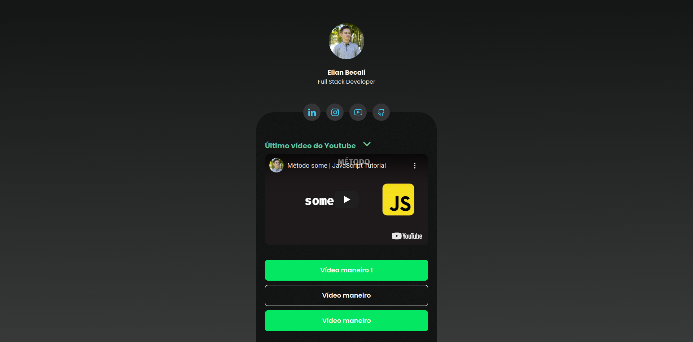

<h1 > 🔗 My Links 🔗 </h1>

* [🎯 About 🎯](#about)
* [📷 Preview 📷](#preview)
* [🚀 Technologies 🚀](#technologies)
* [💥 Demo 💥](#howToUse)
* [👋 Say hello 👋](#sayHello)

<h2 id="about"> About 🎯 </h2>

  This project is about a app for save my links, this app get of `links.json`! 

<h2 id="preview"> Preview 📷 </h2>

    <kbd>
        
    </kbd>

<h2 id="technologies">Technologies 🚀</h2>

<ul>
    <li>HTML</li>
    <li>CSS</li>
    <li>Javascript</li>
</ul>

<h2 id="howExecute"> Demo 💥 </h2>

See demo here  

<h2 id ="sayHello">Say hello 👋</h2>

 

